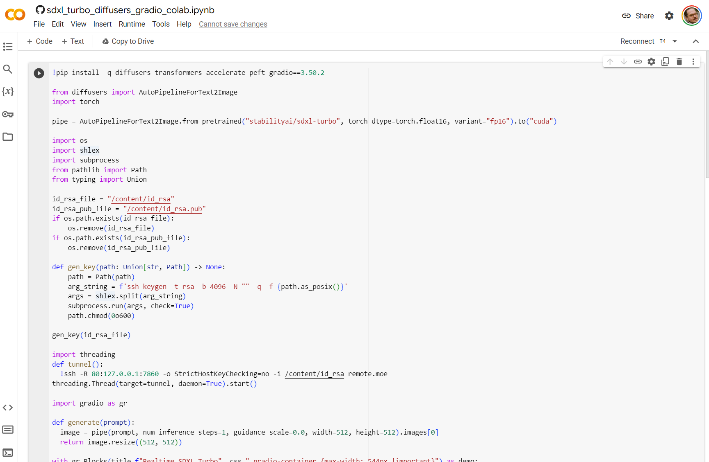
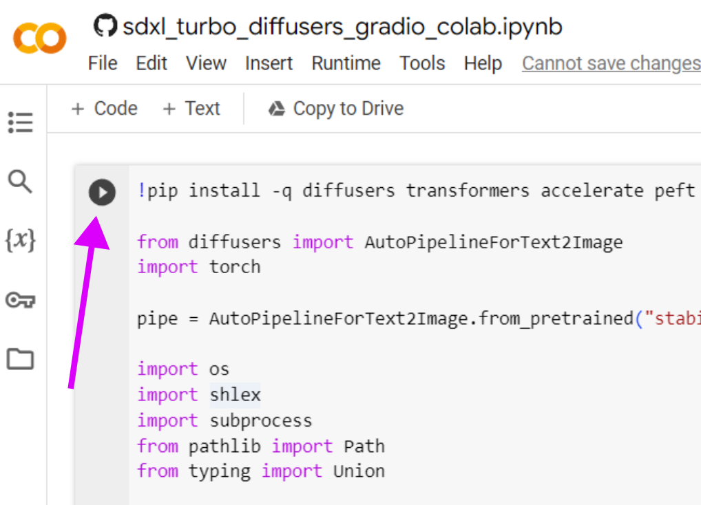
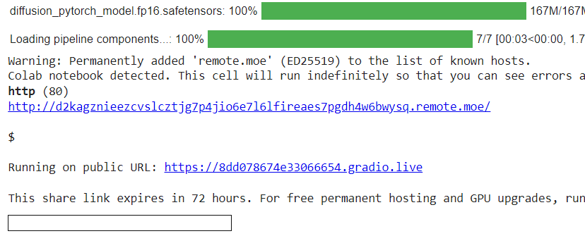
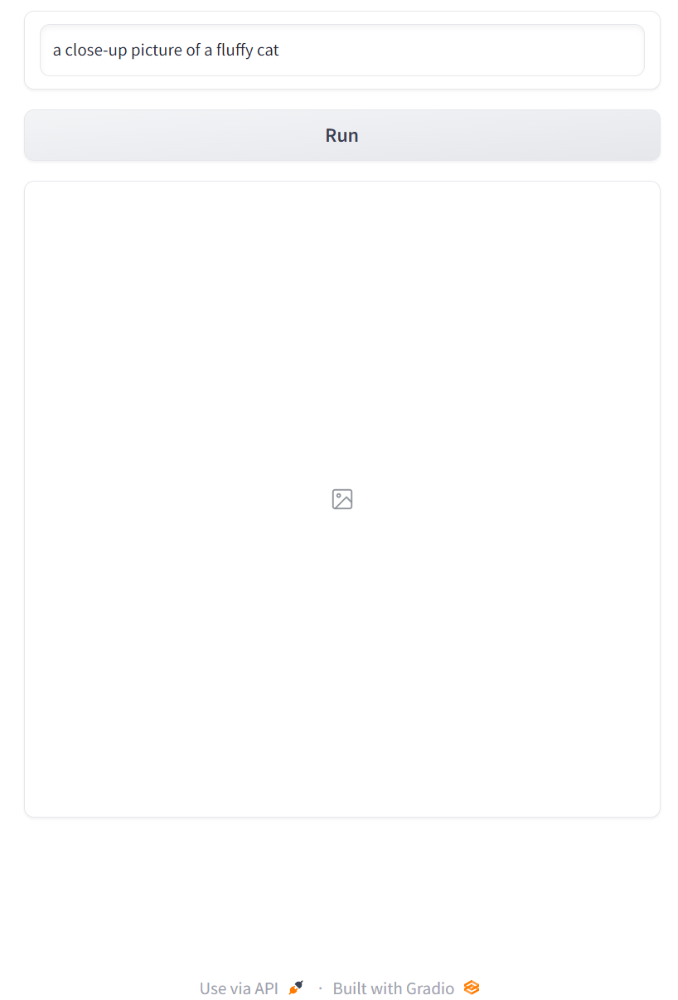

# Image Generation

In this exercise we'll look at how we can use AI to generate images. We're currently in a very rapidly shifting landscape where hundreds of tweaked AI models for image generation are released every month.

This tutorial will serve as a brief introduction to prompting image generation models, and give you some pointers to how you could make the deep dive.

## Stable Diffusion

Popular generation tools like DALL·E and Midjourney are based on their own proprietary AI's, while the line of models from Stability.ai are fully open. These are a family of models under the name Stable Diffusion, and have paved the way for the explosion of image generation we see online at the moment. They have existed in a number of generations, where the currently most popular is Stable Diffusion XL (SDXL). Very recently, a modifed version of SDXL called SDXL Turbo was released, and this is the version we will use for the workshop.

## Running the model

We will use Google's Colaboratory to run our models. This gives us full control over the generation and is completely free. We will use the hot-of-the-presses SDXL Turbo with the colab implementation by camenduru: [sdxl-turbo-colab](https://github.com/camenduru/sdxl-turbo-colab).

To run the model, click on the "Open In Colab" button below:

 

This opens a window like this:

This shows you a "code cell" containing the python program which will run a web server with the Gradio Graphical User Interface. You don't have to understand this code, just hit the "play" button in the top left corner of the cell:

If prompted with *"Warning: This notebook was not authored by Google"*, just hit **"Run anyway"**. The code will run for a couple of minute, most of which is downloading software dependencies and the AI models. Once it's ready, the output below the code cell will display two URL's like this:

Note that the URL's you get will be differently and randomly generated. Click any of these two links to take you to the web UI running on this Colab notebook and you should be greeted by a window like this:

Hit the **Run** button to generate the suggested prompt.

# Prompting

Now we're ready to start with the exercises. Just like with prompting AI's like ChatGPT, the words you use and their order are important. It's not as important to formulate the prompt in a gramatically correct sentence. For example, let's try modifying the default prompt:
`picture close-up cat fluffy`

This gives us result which are quite similar, so in a sense the prompt behaves more like a list of key words. We can add words, for example:

`painting picture close-up cat fluffy`

Creates an image which looks painted. If you try to add `3d render`, you will get an image which is unnaturally sharp etc.

## Keywords

### Word order
While the words behave kind of like key words (grammar is not that important), word order can actually matter and do so in non-intuitive ways. 

### _medium_
Thinking of the prompt as a set of keywords, there are some general components we can think of. In the example above, we added key words which tried to control the _medium_ the image looks to be created in. Other good words can be `pencil drawing`, `crayon drawing`, `oil painting`, `black and white photograph`, `watercolor`, `vector illustration` etc. Also adding adjectives describing this like `wet oil painting` or `blue pencil drawing`

### style modifiers
You can modify the style in other ways, a common example is to add `in the style of X`, where `X` is the name of some prolific artist. Other commonly used words are based on popular online art communities like `art station` or `deviant art`. While these are more subtle in style, they will tend to generate images which might be popular in these communities.

Other style modifiers are those that describe something about the image such as `sloppy`, `exquisite`, `high resolution`, `4k`, `old`, `antique` or `photorealistic`.

### Subject and scene
You might have a subject in mind, but it often helps with overall quality if you also express the scene of the subjects. So instead of just `fluffy cat`, it could be `fluffy cat on a sofa` and instead of just `samurai duck` it could be `samurai duck on a battlefield`

### Fixing the image
You might notice that some parts of the image looks weird, for example the eyes of a fluffy cat you generated. Adding extra words like `perfectly detailed eyes` or `hands with five fingers` might make the generation care more about these details.

## Excercise 1 - splash image for presenation

You've been invited to give a presentation at the regional innovation hub to present your research and you expertise. The seminar is open to the general public, so the talk will need to be on a popoular scientific level. **Create a splash image to be shown on the first slide together with the title of your pop-sci presentation**.

The image should convey something important about your research or your area. The tone should match how you like to present things to a non-technical audience, so try to generate images which match material you might already have. The tone should likely be serius and not overly dramatic.

## Excercise 2 - Career fair image for the department

The head of your research group has received a last minute request to present your group at a career fair organized by the local university. Since your group leader doesn't have time to do it, the task falls to you.

**Create an image for a blurb on the career fair website and for the poster which will represent your research group**

The image should be more flashy and eye-catching than in the previous exercise, while still conveying something interesting about the work that your group does. The audience are under graduate students who are considering their futures, what would be interesting images to attract them?

## Exercise 3 - AI blog post

As you are an expert prompt engineer, you have been invited by an PhD advisory program to write a blog post explaining the dangers of AI. The blog post requires at least three images to make the web administrators happy.

**Create a series of three (or more) images to support a blog post about the dangers of AI (you are free to come up with dangers as you like)**

The images can be truly fanciful, and drawing inspiration from mythology/folk lore/horror will help to reinforce the message your text delivers. You don't have to write any text, but if you'd like you can use ChatGPT to help you.

## Inspiration
Looking at what prompts others have used to generate images can be helpful as a start, here are popular sites which showcase generated images:

- [CivitAI](https://civitai.com/)
- [Lexica.art](https://lexica.art/)
- [mage.space](https://www.mage.space/explore)
- [Public Prompts](https://publicprompts.art/)

# Next steps

In this workshop we've used SDXL Turbo. It's main advantage is that it's very fast, but if you want more control and better generation you can try out regular SDXL using this colab:

 

If you would like to dive deeper into this AI mealstrom, a good place to start is by installing [ComfyUI](https://github.com/comfyanonymous/ComfyUI). It's a powerful playground for designing generation workflows, supporting most of the models you can find on CivitAI. Do make full use of the software, you need a relatively recent GPU. While it's possible to generate images using only the CPU, it's much slower and mostly just useful to try things out.